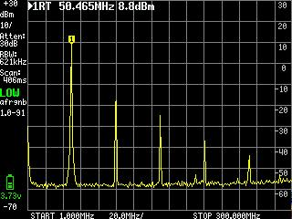
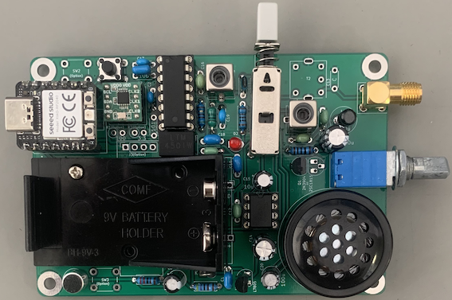
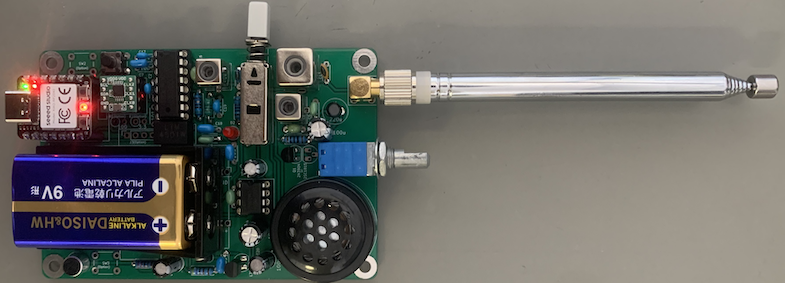
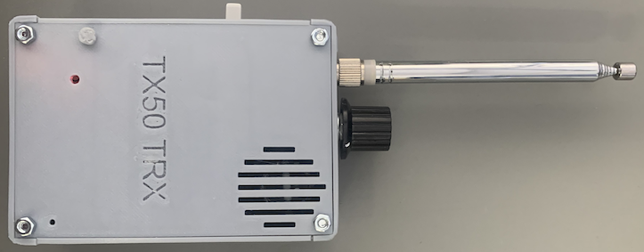

# TX50（CRkits共同購入プロジェクト）の改造

 CRkits共同購入プロジェクトで頒布されているTX50送信機（http://jl1kra.sakura.ne.jp/TX50R50.html
 ) を改造し，シンプルなAMトランシーバーにしました．  

## TX50送信機の複数周波数で通信可能なトランシーバーへの改造
TX50は元々JH1FCZ氏が開発された10mW出力のトランスレス50MHz帯コレクタ変調AM送信機をCRkits共同購入プロジェクトが復刻キット化したものです．  
キットでは水晶発振器で50.55MHzあるいは50.62MHzを発生させ，その周波数で運用します．  
QP-7Cの改造との場合と同様に，まず，発振段にSi5351モジュールを使用することで，複数周波数での使用を容易にしました．  
また，Si5351は，複数の端子に比較的自由な周波数の信号を出力できますので，それを利用したスーパーヘテロダイン受信機を作成し，トランシーバー化しました．  
受信機のAFアンプには，TX50送信機のマイクアンプ(LM386)を使い回し，スピーカー出力としました．  
電源には006P(9V)を使用し，PTTスイッチで送受信を切り替えました． 

改造は以下の2点です．  

### 1．発振段のSi5351化
	Si5351モジュール（秋月電子）を使用し，発振出力をファイナル段に入力しました．  
	ファイナル段の入力は自己バイアス回路とし，Si5351の出力をコンデンサを介してベースに導入しています． 
	2N3904のベースーコレクタ間に自己バイアス用に100kΩの抵抗を接続しています． 
	T2とC13無しの直結状態で，無変調時に7.6mWの出力を確認しました．  
	新スプリアス規格のスペクトル領域の信号強度50μW(-13dBm)以下を満たしています． 
	Si5351モジュールは，Seeed Xiao RP2040でI2Cインターフェースを介して制御しました．  
	タクトスイッチで，プリセットした周波数を順次変更できるようにしました．  
  
TinySAによる送信スペクトル測定結果（T2とC13無し，無変調時）

### 2．シングルスーパー受信機を使用したトランシーバー化  
	QP-7Cの改造の場合と同様にラジオICであるCD2003を使用し，IF 450kHz(あるいは455kHz)で，セラミックフィルターによる帯域制限を行いました．  
	局所発振信号はSi5351モジュールから加えています．  
	AFアンプにはTX50のマイクアンプを，切り替えて使用しています．  
	プリRFアンプなしでの最終的な感度は50MHz帯で-75dbmのAM信号がかろうじて検知できる程度でした(TinySAと耳による)．  
	送受信の切り替えは，4回路2接点のプッシュスイッチを　PTTスイッチとして使用しました．  
   
回路図は，
  
赤丸はTX50送信機キットの部品をそのまま使用，ピンク丸はキットで余った部品を流用，それ以外は別途準備した部品です．  
受信部はCD2003を使用したシングルスーパー受信機です．  
50MHz帯では感度が不足しそうですが，今回は送信機出力が10mWとQRPpなのでプリアンプなしで製作しました．  
IFフィルターにはLTMxxxYYが使用できます．とりあえず，LTM450IWで作りました．  
アンテナコネクタの近くのT2とC13はロッドアンテナを使用した場合のマッチング用ですので，使用しない時は取り付けないで，基板のT2の1番ピンと5番ピンをショートします．  
ロッドアンテナを使用する場合，この回路はGAWANTもどきで調整が必要です(具体的な調整は変更申請が終わってから行う予定です)．  
(option)で示された部品はOLED接続用，OLEDに対応した詳細な周波数変更用のタクトスイッチ，およびSSB受信用のBFO部品です．  
AGC電圧をSeeed Xiao RP2040のアナログ入力に接続してあるので，OLEDを繋げば信号強度の表示も可能なはずです．  
(option)部分の利用に関するプログラムは，現時点では作っておらず，具体的な作成計画もありません．  

   
ロッドアンテナ不使用で部品をつけた状態（プロトタイプ基板）  
  
  
ロッドアンテナ仕様にした状態（プロトタイプ基板）  

受信機の入力段に送信機キットで余ったDIY7をBPFとして挿入していますので，受信感度が最大になるようにコアを調整する必要があります．  
もちろん送信部のコアの調整も必要です

#### Seeed Xiao RP2040用スケッチは"TX50-TRX-XIAO.ino"です．  
	ボードマネージャは，Earlephilhower版 Raspberry Pi Pico/RP2040が使用できます．
	この際，ボードとしてSeeed Xiao RP2040を選んでください． 
 	また，消費電流を減らすため．CPU Speedは最低の50MHzにセットして下さい． 
  	プログラムの62行目の”set_sys_clock_khz(18000, true);”を有効にすると，システムクロックは18MHzまで下がって，消費電流がさらに減少します． 
   	但し，このクロック周波数ではUSBシリアル通信機能が失われますので，新たに別のプログラムを書き込みたい場合は．一旦，プログラミングモードにする必要があります． 
   	（プログラミングモードは，BOOTボタンを押しながらRESETボタンを押すと入れます． USBメモリの様にマウントされます．） 
	今回はUSB Audioを使用していないので，Raspberry Pi Pico mbed版は必要ありません． 
	どうしてもmbed版を使いたい場合はQP-7C_RP2040のページを参照して下さい． 
	SI5351aの制御には，"Etherkit SI5351"ライブラリーを使用しました． 
	選択周波数はオンボードのカラーLEDの色で表示することにし，その制御には"Adafruit_NeoPixel"ライブラリーを使用しました． 
	#define FREQ_0 から　#define FREQ_6 で運用したい周波数を設定します． 
	タクトスイッチを押すたびに，次々に周波数が変化し，カラーLEDの色が変わります． 
	
#### JLCPCB用のガーバーファイルは"TX50-TRX-XIAO_gerber.zip"で，Kicadのファイルは"TX50-TRX-XIAO_kicad.zip"です．  
	実際にはプロトタイプ版で動作テストをしており， これはそのマイナーチェンジ版(現時点では未テスト)です．  
 
#### ケースの3Dプリンタデータファイルは"TX50-TRX-XIAO-BOX_stl.zip"です．  
	M3 35mmネジ 4本で固定できます．  
  

#### 必要部品(2023年9月27日時点の価格)  
	TX50キット：CRkits共同購入プロジェクト，1850円 + 180円（送料）　http://jl1kra.sakura.ne.jp/TX50R50.html  
	Seeed Xiao RP2040：たとえば秋月電子 830円　https://akizukidenshi.com/catalog/g/gM-17044/
	秋月電子Si5351モジュール：秋月電子，500円　https://akizukidenshi.com/catalog/g/gK-10679/  
	8ピンICソケット（秋月電子Si5351モジュール用）：1個
	CD2003GP：たとえばaitendo，165円　https://www.aitendo.com/product/1528
	16ピンICソケット（CD2003GP用）：1個
	LTM455IW or LTM450IW：秋月電子，1個110円(LTM455IW) or 10個300円(LTM450IW) https://akizukidenshi.com/catalog/g/gP-16374/ or https://akizukidenshi.com/catalog/g/gP-16052/
	三端子レギュレーター　５Ｖ１００ｍＡ：例えば，TA78L05S　秋月電子，20円　https://akizukidenshi.com/catalog/g/gI-08973/
	分割ロングピンソケット　１×４２（Seeed Xiao RP2040ソケット受けが必要ならば）：秋月電子，1個80円　https://akizukidenshi.com/catalog/g/gC-05779/  
	ピンヘッダ　１×４０：（Seeed Xiao RP2040用）秋月電子，1個35円　https://akizukidenshi.com/catalog/g/gC-00167/  
	プッシュボタンPS-42F42：aliexpress（ロックなし，あるいはロック付き）やaitendo（ロック付き 44円，ただし準備中）
	基板取付用２連ボリューム　スイッチ付　A10ｋΩ：秋月電子，180円　https://akizukidenshi.com/catalog/g/gP-12579/
	基板取付用スピーカーユニットUGSM30A-8-01：秋月電子，120円　https://akizukidenshi.com/catalog/g/gP-09270/
	006P電池ホルダー BH-9V-3P24：秋月電子，50円　https://akizukidenshi.com/catalog/g/gP-08160/
	タクトスイッチ：例えば秋月電子，15円　https://akizukidenshi.com/catalog/g/gP-17166/
	整流用ショットキーダイオード：例えば１Ｓ４，秋月電子10本　140円　https://akizukidenshi.com/catalog/g/gI-16384/
	電解コンデンサ100μF(オーディオ出力用）C21：1個  
	積層セラミックコンデンサー106（CD2003のAGC用）C8： 1個
	積層セラミックコンデンサー105（電源，オーディオ用）C1, C11，C19： 3個    
	積層セラミックコンデンサー104（CD2003用）C18，C20： 2個
	積層セラミックコンデンサー103（CD2003のLO入力用）C3： 1個
	(積層)セラミックコンデンサー101（TX50入力用，RF受信用）C2，C12： 2個
	インダクター10uH（CD2003用）： 1個（マイクロインダクター，アキシャル型）
	抵抗　51Ω(CD2003のLO入力用）：1個  
	
	ロッドアンテナを使用する場合は，FCZコイル１０ｍｍ角50MHz用（サトー電気）とコンデンサー（15pF?）
	ロッドアンテナ：例えば，秋月電子，WH-281SM　500円　https://akizukidenshi.com/catalog/g/gP-00236/

